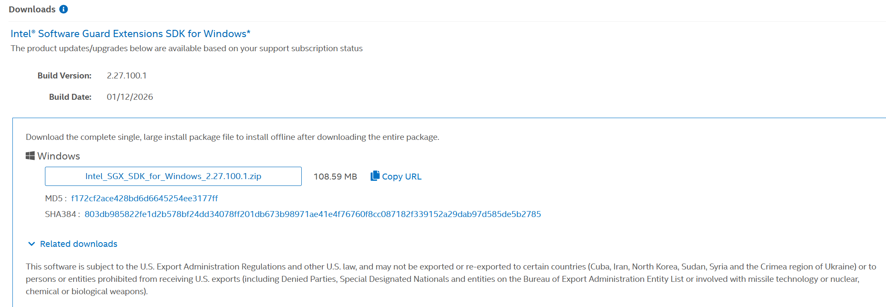
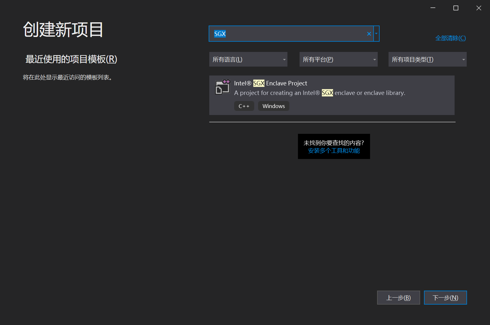
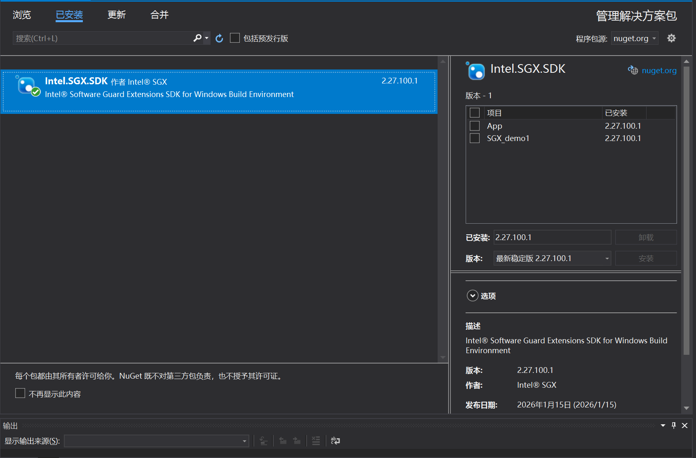
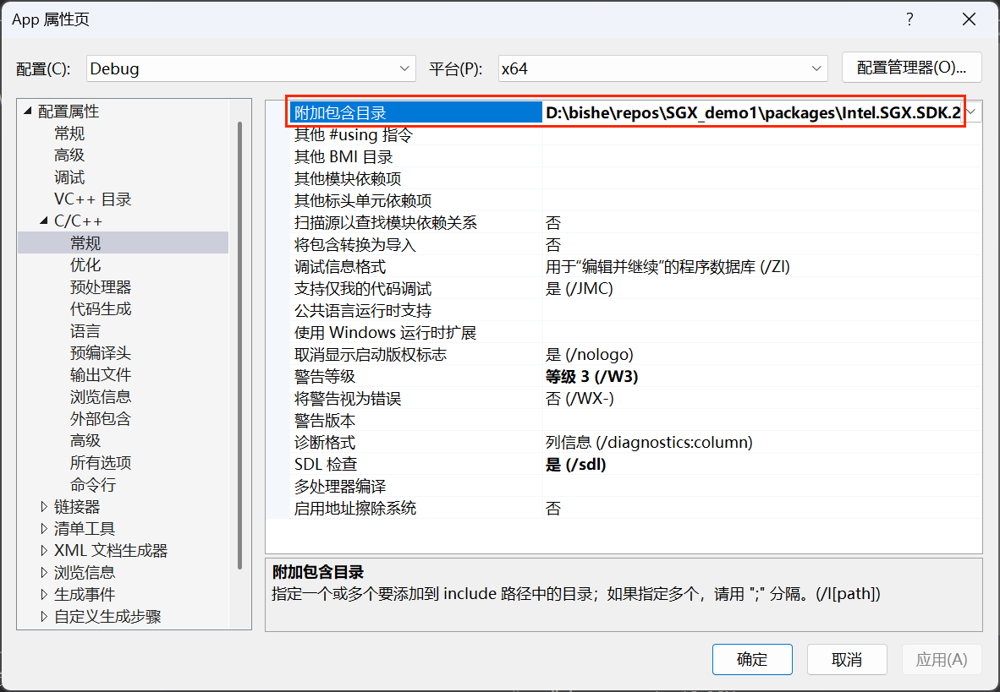
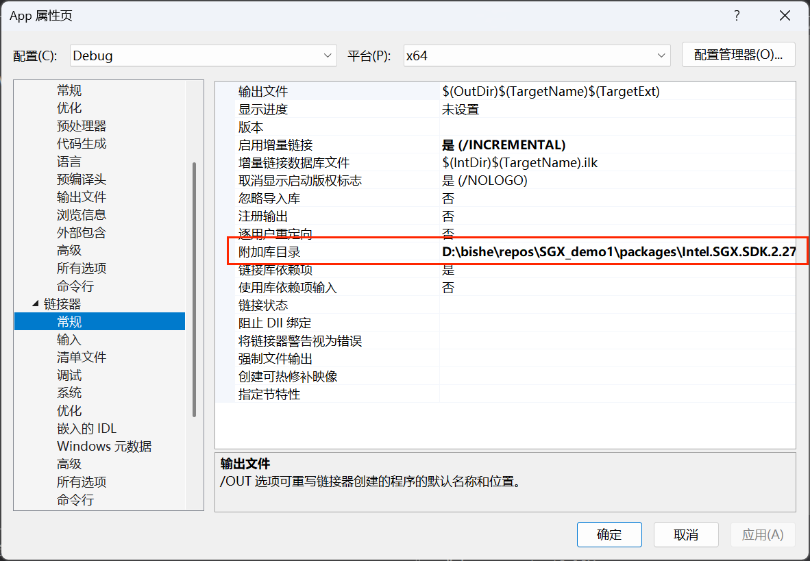

# 我的毕设

这个项目是本人的毕设，目前只跑通了一个小demo，其实也就是把环境配了一下，当然配环境的过程还是很痛苦的，我的cpu是AMD的所以只能用Simulation Mode，但又由于这个SDK找不到，我目前只能找到最新版的，但是最新版的SDK确实非常难用，旧版说是要付费订阅，所以只好用新版＋手动配置Simulation来实现相同的效果，但是最后肯定是要打包到Intel处理器上进行测试的，当然这都是后话了。

## 一、前置知识

**1.Enclave**

SGX 在内存中划出了一块受硬件保护的区域，叫做 **Enclave** ，直译为飞地，可以理解为安全区，这里面的数据都是加密的，即使是操作系统，虚拟机甚至是BIOS都无法查看或者修改里面的内容，外部程序只能通过特定的“窗口”（接口）把数据递进去，Enclave处理完再递出来。

**2.Attestation**

简单来说就是就是信任链与认证机制，为了知道自己访问的那个Enclave是真的，引入了认证机制。CPU 会记录 Enclave 初始化时的代码和数据（像指纹一样），生成一个签名，通过第三方实体（Intel 认证服务或自建认证服务）来验证这个签名 。只有签名对上了，才证明这个 Enclave 是原本那个“好人”，且运行在安全的 SGX 平台上 。

**3.ECALL 与 OCALL**

App是不可信部分，负责读文件、联网、处理ui，而Enclave是可信部分，负责存密钥、算加密，连接这两个部分的就是进出通道ECALL 与 OCALL，App通过前者呼叫Enclave进行，Enclave通过后者呼叫App。

**4.密码学相关**

需要一点AES和DES的相关知识，不再赘述。

## 二、环境要求

我是在Windows上做的，最好是Intel处理器，AMD的话非常及其之麻烦，另外Visual Studio需要2019或者2017的，2022的有问题，安装SDK的时候不会被识别，然后SDK的话自己有 Intel® Software Guard Extensions SDK for Windows 1.16或者更古早的版本是最好的，没有的话我之后会给出如何找最新版的，Intel的产品非常反人类，即使是这个包也非常难找

## 三、主要结构

需要说明的是一些临时文件和包文件因为太大了传不上来遂弃，需要自己照然后通过NuGet进行安装

```
SGX_demo_base/
├── App/                   # 非安全区应用程序
│   ├── App.cpp            # 主程序入口
│   ├── SGX_demo1_u.h      # 自动生成的不可信桥接头文件
│   └── SGX_demo1_u.c      # 自动生成的桥接代码
├── SGX_demo1/             # Enclave
|   ├── SGX_demo1_private.pem # 私钥 我这里没传
│   ├── SGX_demo1.cpp      # Enclave实现
│   ├── SGX_demo1.edl      # EDL接口定义
│   ├── SGX_demo1_t.h      # 自动生成的可信桥接头文件
│   └── SGX_demo1_t.c      # 自动生成的桥接代码
├── packages/              # NuGet 依赖包（通过nuget restore恢复）太大了传不上
├── SGX_demo1.sln          # 解决方案
├── readme.md
└── .gitignore
```

## 四、前置工作

### 1.准备Visual Studio 2019

这个比较简单，不再赘述

### 2.下载安装SDK

> **注意：一定要先装vs再装SDK**

必装Intel SGX SDK，PSW的话如果有支持SGX的硬件必装，如果是模拟模式，就可以不装了，最后算数据的时候在Intel电脑上装就行。

[产品连接]: https://lemcenter.intel.com/productDownload/?Product=3407

从这个连接点进去，你大概率还没有注册，先注册一手，推荐用谷歌邮箱，qq或者163容易收不到消息,然后申请你要的sdk，点击download就可以看到了



然后下载那个安装包。

> 可以看到The product updates/upgrades below are available based on your support subscription status，基本上就是说根据你的账号订阅级别（是否付费/VIP），我们决定给你看哪些下载链接，通俗一点就是Intel 并没有向你的（免费）账号开放旧版本的下载权限。

另：下载了最新版的意味着我们必须手动构建启动器来进行了

### 3.安装插件

在类似这个文件路径下，你会看到两个后缀名为.vsix的文件

```
Intel_SGX_SDK_for_Windows_2.27.100.1\plugin\vs2019
```

双击安装到Visual Studio 2019即可。

安装完了应该是这样的。

#### 

### 4.安装SDK到项目

在右侧“解决方案资源管理器”里，右键项目 `SGX_demo1`，选择“管理 NuGet 程序包 (Manage NuGet Packages...)”，安装SDK到项目里面，类似这样：



## 五、快速开始

### 1.克隆仓库

```bash
git clone https://github.com/zmh-123/SGX_demo_base.git
cd SGX_demo_base
```

### 2.恢复依赖

参考3.4

### 3.生成签名密钥

```powershell
cd SGX_demo1
openssl genrsa -out SGX_demo1_private.pem -3 3072
```

### 4.配置头文件路径和修复链接错误

找到packages里面include和bin的文件夹，复制路径，右键App项目，在属性里面粘贴进去，这样：

include粘贴到这里：



bin粘到这里（修复链接错误）：



### 5.链接依赖项

在链接器->输入->附加依赖项中输入这两个文件名：

```
sgx_urts.lib;
sgx_uae_service_sim.lib
```

**注意：下载的最新SDK里面没有直接提供sgx_urts.lib，所以我们要找到sgx_urts_simd.dll这个文件重命名为sgx_urts.dll骗过系统，然后粘贴到SGX_demo1\x64\Debug（和App.exe文件在同一目录下）下。**

### 6.修改工作目录

打开App项目里面的属性，点击调试，找到工作目录，将默认值`$(ProjectDir)`改为`$(OutDir)` 。

### 7.明确模拟

在SGX_demo1的属性页，找到C/C++->预处理器，在预处理器定义里，在最后面加上：**`;SGX_SIM;Simulation`**。

## 六、解决一些问题

### 1.让App端认识EDL文件

右键App项目中，选择添加->现有项，然后退回上一级目录进入`SGX_demo1` 文件夹，选中 **`SGX_demo1.edl`**，点击 **“添加”**。

### 2.让VS可以编译.edl文件

普通的 `.cpp` 文件，编译器知道怎么编。但 `.edl` 是 Intel 独有的格式，如果 App 项目没有正确加载 Intel 的插件规则，它就会把 `.edl` 当作一个普通的“文本文档”处理，所以右键菜单里的“编译”是灰色的（不可用）。

**右键点击** `App` 项目下的 **`SGX_demo1.edl`**。选择属性，确保配置是Debug，平台是x64（**不支持32位的**），找到常规，找到项类型下拉找到自定义生成工具，点击应用，左侧菜单栏会多出一项“自定义生成工具”，填入两个框

**1.命令行**

```bash
"$(SolutionDir)packages\Intel.SGX.SDK.2.27.100.1\bin\win32\release\sgx_edger8r.exe" --untrusted "%(FullPath)" --search-path "$(SolutionDir)packages\Intel.SGX.SDK.2.27.100.1\include"
```

**2.输出**

```
%(Filename)_u.h;%(Filename)_u.c
```

如果这样编译不能生成桥接文件SGX_demo1_u.h` 和 `SGX_demo1_u.c的话，尝试手动执行：

找到包里面包含sgx_edger8r.exe文件，复制路径，还有include文件夹路径复制下来，进入App文件夹目录，打开cmd（注意不是powershell）：

```bash
"D:\bishe\repos\SGX_demo1\packages\Intel.SGX.SDK.2.27.100.1\build\native\bin\win32\Release\sgx_edger8r.exe" --untrusted ..\SGX_demo1\SGX_demo1.edl --search-path "D:\bishe\repos\SGX_demo1\packages\Intel.SGX.SDK.2.27.100.1\build\native\include"
```

执行完之后可以看到App目录中凭空出现两个文件SGX_demo1_u.c和SGX_demo1_u.h，然后回到VS，**右键点击 `App` 项目** -> **添加** -> **现有项**。选中刚才生成的 **`SGX_demo1_u.c`**，点击 **添加**。

> 注意：每次修改.edl文件都必须重新运行一次那个 CMD 命令。
